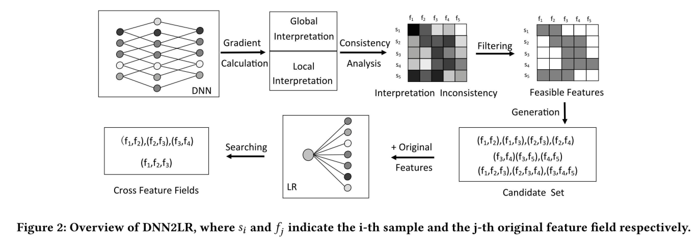

# DNN2LR


Implementation of DNN2LR paper (https://arxiv.org/pdf/2102.12036.pdf)

## Env
Just install `lightautoml` [whl file](./env/LightAutoML-0.3.7.4-py3-none-any.whl) with
```
$ pip install file.whl
```

## Data
More about data [here](./data/readme.md).

## Code
Each model in models folder have scripts to generate configs and run it. All experiments can be run with 
```python
(env) python run.py
```

We have used `lightautoml` library with modification to save gradients during train-eval loop.

## Experiments results
Different graphics and tables you can see [there](./evaluation/analytics.ipynb).

## How to use
If you want to add your datasets just add the appropriate changes to the [data generation script](./data//get_config.py).

## Links
LightAutoML - [Fast and customizable framework for automatic ML model creation (AutoML)](https://github.com/sb-ai-lab/LightAutoML)
